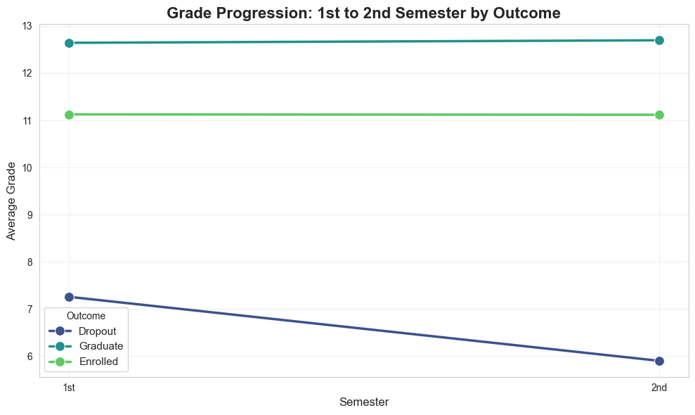
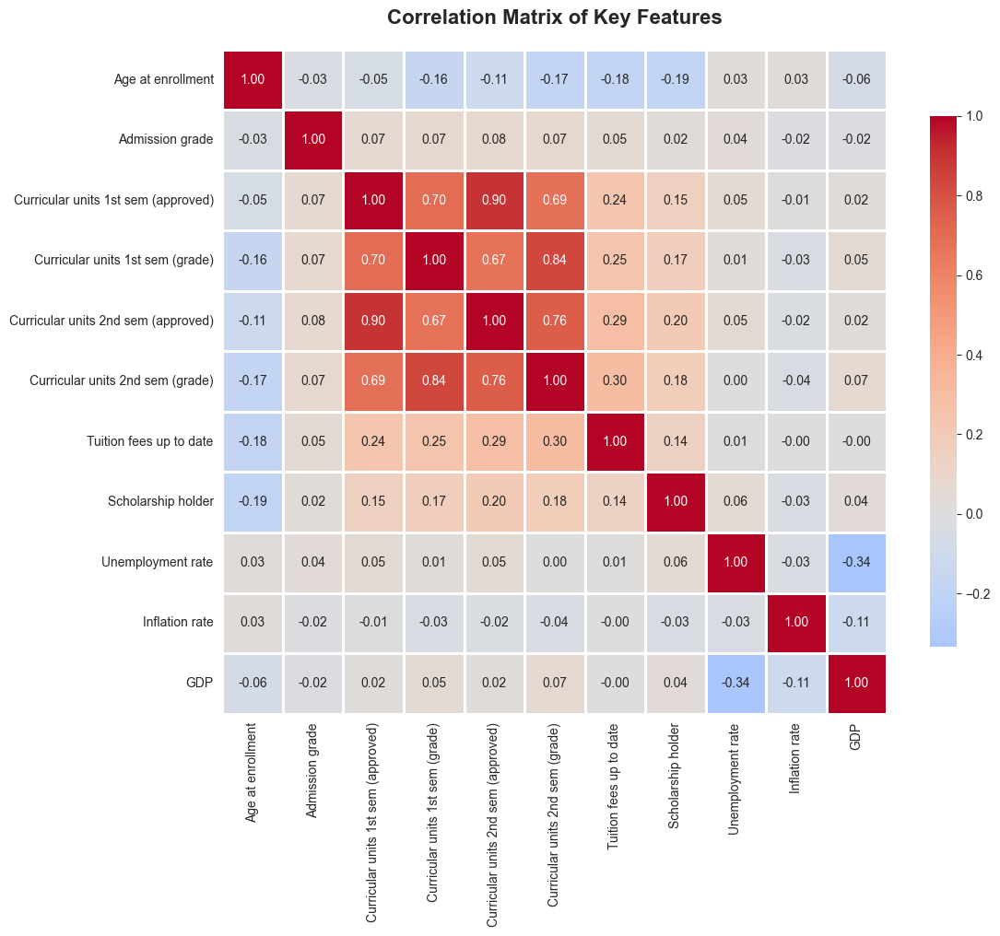
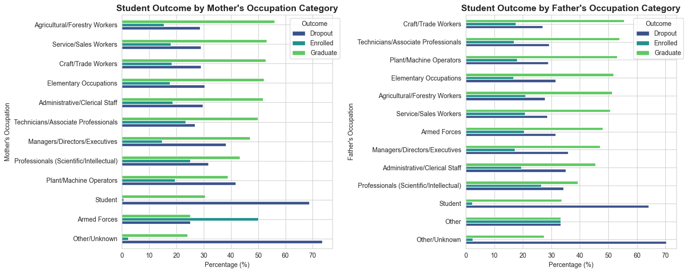
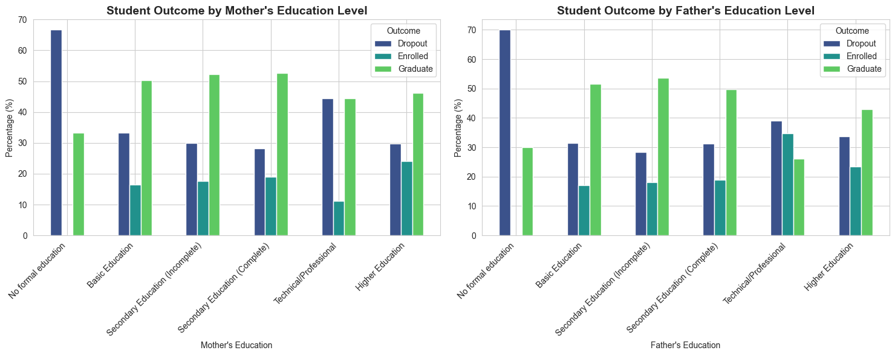
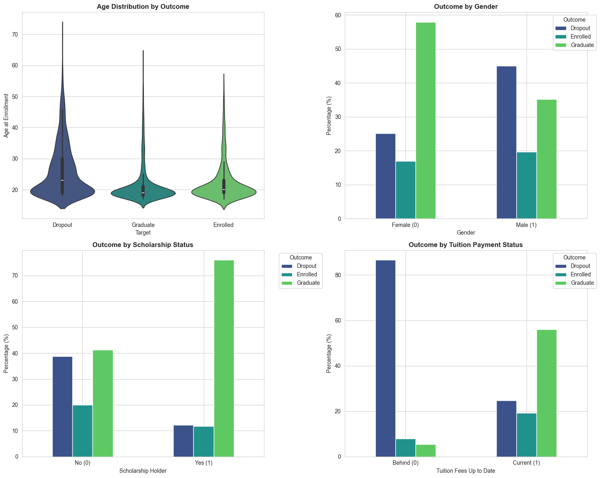
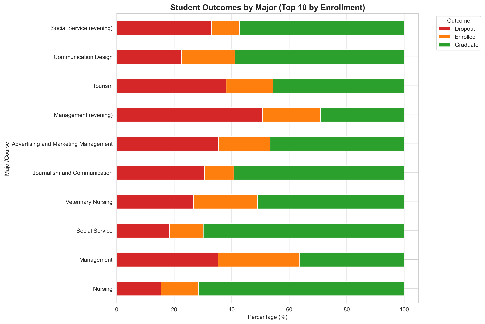

# Exploratory Data Analysis: Student Success Prediction

**Source:** UCI Machine Learning Repository - [Predict Students' Dropout 
and Academic Success](https://archive.ics.uci.edu/dataset/697/predict+students+dropout+and+academic+success)

**Institution:** Portuguese higher education institution

**Collection Method:** Administrative enrollment and academic records

**Structure:**
- **4,424 students** across multiple undergraduate degree programs
- **36 features** organized into categories:
- **Demographics:** Age, gender, marital status, nationality
- **Socioeconomic:** Parent education/occupation, scholarship status,
debtor status
- **Academic background:** Previous qualifications, admission grades,
application details
- **Performance metrics:** Semester-by-semester enrolled/approved units
and grades
- **Economic context:** Macroeconomic indicators (unemployment,
inflation, GDP)
- **Target variable:** Dropout, Enrolled, or Graduate

**Relevance:**
This dataset addresses a critical real-world problem: student retention in
higher education. Early prediction of at-risk students enables timely
interventions, improving both student outcomes and institutional retention
rates. The rich feature set allows exploration of how academic, personal,
and economic factors interact to influence student success.

## Dataset Selection and Motivation

This analysis uses the "Predict Students' Dropout and Academic Success" dataset from the UCI
Machine Learning Repository, which contains information from a Portuguese higher education
institution. The dataset includes 4,424 student records across multiple undergraduate
programs with 36 features spanning demographics, socioeconomic factors, academic background,
and performance metrics.

I chose this dataset for several compelling reasons. First, the topic is highly relatable as
a current student, I am naturally interested in understanding the complex factors that
contribute to student success and failure beyond simple academic performance metrics.
Second, the dataset is recent, real world data rather than synthetic, providing authentic
insights into actual educational outcomes. The rich feature set provides numerous
opportunities for meaningful analysis and storytelling about the complex factors influencing
student success. Finally, the dataset is well suited for classification and presents
realistic challenges such as class imbalance that mirror real world machine learning
scenarios.

The target variable classifies students into three categories: Dropout (32.1%), Graduate
(49.9%), and Enrolled (18.0%). This moderate class imbalance, with a 2.78:1 ratio between
majority and minority classes, will require careful handling through techniques like SMOTE
or class weighting during the modeling phase.

## Key Findings from Exploratory Data Analysis

### Academic Performance is the Strongest Predictor

The most striking finding is the dramatic gap in academic performance between graduates and
dropouts. Graduates maintain an average first semester grade of 12.64 out of 20, while
dropouts average only 7.26, creating a 5.39 point gap. Even more revealing is the grade
trajectory: graduates improve slightly from first to second semester (+0.05 points), while
dropouts decline significantly (1.36 points). Students who remain enrolled maintain steady
grades around 11.1 in both semesters, suggesting they are neither excelling nor struggling
critically.

The correlation matrix reveals extremely strong relationships between approved units and
grades (r > 0.84 for both semesters), indicating potential multicollinearity issues that
will require feature selection during modeling. Additionally, age shows negative
correlations with academic performance, suggesting older students may face additional
challenges balancing education with other life responsibilities.

### Zero Grades as a Critical Early Warning Signal

One of the most actionable findings is that 16.2% of students receive zero grades in the
first semester, and a staggering 79.3% of these students ultimately drop out. This
represents one of the strongest early warning indicators in the dataset. These students
enrolled in courses but either never took evaluations or failed to earn any credit,
signaling severe academic disengagement. This pattern provides universities with a clear
intervention point: identifying students with zero first semester grades could enable
targeted outreach and support services before it is too late.

### Counterintuitive Socioeconomic Findings

Contrary to conventional wisdom, higher parental education and professional occupations do
not guarantee better student outcomes. Students whose mothers have higher education degrees
show only a 46.1% graduation rate, actually lower than those whose mothers completed
secondary education (52.7%) or have only basic education (50.2%). Similarly, students whose
mothers work in professional scientific or intellectual fields have a 43.3% graduation rate,
while those whose mothers work in agricultural, service, or craft occupations show
graduation rates above 52%.

This unexpected pattern appears even more pronounced for fathers: students with fathers in
professional fields graduate at only 39.2%, compared to 55.5% for those with fathers in
craft and trade work. This counterintuitive finding challenges assumptions about privilege
and suggests that family socioeconomic status alone does not protect against dropout.
Possible explanations include higher parental expectations creating additional pressure,
students from higher SES backgrounds having more financial safety nets allowing them to
dropout and try alternative paths, or selection bias where students from educated families
may be more likely to pursue higher education even without strong academic preparation or
motivation.
 
  

### Financial Stress Compounds Academic Struggles

The data reveals a dangerous interaction between financial stress and academic performance.
Among students with low first semester grades (below 10), those behind on tuition payments
have a 96.2% dropout rate compared to 72.4% for those current on payments. This 23.8
percentage point amplification effect demonstrates that financial stress does not just
independently predict dropout but rather multiplies the impact of academic struggles. This
finding has clear policy implications: financial aid or payment flexibility programs should
particularly target academically struggling students, as this population faces compounded
risk.

### Scholarship Impact Varies Dramatically by Age

Scholarship support shows markedly different effects across age groups. For traditional age
students (20 and under), scholarships increase graduation rates by 27.0 percentage points.
However, for students aged 21 to 25, the scholarship impact more than doubles to 40.2
percentage points. This suggests that slightly older students, who may have more financial
obligations or work commitments, benefit disproportionately from scholarship support.
Interestingly, the oldest students (over 30) also show large scholarship effects (+40.1
points), while the 26 to 30 age group shows minimal benefit (+8.8 points). These patterns
could inform scholarship allocation strategies to maximize retention impact.

### Demographic Patterns and Age Effects

Female students comprise 64.8% of the dataset and show marginally higher graduation rates
than male students (51% versus 47%). This gender gap persists across most program types,
though it narrows in technical fields like Informatics Engineering. Marital status reveals
that 88.6% of students are single, which aligns with the predominantly young student
population. The small number of married students (8.6%) show slightly higher graduation
rates, possibly reflecting greater stability and commitment.

Age at enrollment shows a negative relationship with academic success. Younger students (20
and under) have higher graduation rates, while each successive age bracket shows declining
performance. This age effect likely reflects the increasing difficulty of balancing
education with work and family responsibilities as students get older.

Marital status also reveals that 88.6% of students are single, which aligns with the predominantly young student population. The small number of married students (8.6%) show slightly higher graduation rates, possibly reflecting greater stability and commitment. Age at enrollment shows a negative relationship with academic success. Younger students (20 and under) have higher graduation rates, while each successive age bracket shows declining performance. This age effect likely reflects the increasing difficulty of balancing education with work and family responsibilities as students get older.

### Program Specific Variation

Different academic programs show dramatically different success rates. Nursing and Social Service programs demonstrate the highest graduation rates (above 70%), while programs like Management and certain technical fields show higher dropout risks. This variation suggests that program specific factors such as difficulty, teaching quality, student preparedness, or career prospects play important roles in student persistence. Understanding these program level differences could inform targeted retention strategies tailored to the unique challenges of different fields of study.

## Challenges and Open Questions for Modeling

### Data Sparsity and Categorical Imbalance

Several categorical variables show extreme imbalance that will require careful handling.
Nationality is heavily skewed, with 97.5% of students being Portuguese and only 2.5%
international. This severe imbalance makes it difficult to draw reliable conclusions about
international student experiences, though the available data suggests they may face
additional challenges. Similarly, some course programs have very small sample sizes, with
the smallest containing only 12 students (0.3% of the dataset) compared to the largest with
766 students (17.3%). These rare categories may need to be collapsed or excluded from
certain analyses.

### Sample Size Limitations

While the dataset contains 4,424 student records, which may seem substantial, machine learning models generally benefit from larger sample sizes, particularly when dealing with complex multi-class classification problems with 36 features. With the data split across three outcome classes and further subdivided by 17 different academic programs, some subgroups become quite small. This limitation becomes especially concerning when attempting to model rare events or understand interactions between multiple categorical variables. A larger dataset would provide more stable parameter estimates, better generalization performance, and greater confidence in identifying subtle patterns and interaction effects. Additionally, techniques to address class imbalance such as SMOTE require sufficient samples to generate meaningful synthetic examples.

### Feature Engineering Opportunities

The analysis reveals several promising candidates for engineered features, each supported by strong empirical evidence. A grade trajectory metric (second semester grade minus first semester grade) shows exceptional discriminative power, with graduates improving slightly (+0.05 points) while dropouts decline significantly (1.36 points), creating a 1.41 point separation between these groups. A success rate ratio (approved units divided by enrolled units) demonstrates even clearer differentiation, with graduates achieving 90.3% success rates compared to only 38.4% for dropouts. Family socioeconomic status indices combining parent education and occupation could create more robust predictors than individual variables, though the relationship appears more nuanced than initially expected.

Additionally, an early warning flag for students with first semester grades below 10 identifies a high risk population with 79.4% dropout rates, compared to only 22.9% for students above this threshold, making at risk students 3.5 times more likely to dropout. A financial stress composite combining debtor status and tuition payment timeliness also shows strong predictive value, with financially stressed students experiencing 70.6% dropout rates versus 23.8% for those without financial concerns. Finally, interaction terms between financial indicators and academic performance could capture the compounding effects observed in the data, where financial stress amplifies the impact of poor academic performance by 23.8 percentage points.

### Multicollinearity and Feature Selection

The extremely high correlations between approved units and grades (r > 0.84) will
necessitate careful feature selection to avoid multicollinearity issues during modeling.
Regularized models like Ridge or Lasso regression, or tree based methods that handle
correlated features better, may be particularly appropriate for this dataset.

### Class Imbalance Handling

The underrepresented "Enrolled" class (only 18% of students) will require special attention
through techniques such as SMOTE, class weight
adjustments, or ensemble methods that can handle imbalanced data effectively.

## Conclusion

This exploratory analysis reveals that student success is influenced by a complex interplay
of academic performance, financial stability, family background, and demographic factors.
While some findings confirm intuitions, such as the critical importance of first semester
grades and the benefit of scholarship support, others challenge conventional assumptions
about the protective effects of higher socioeconomic status. The identification of zero
first semester grades as a powerful early warning signal provides universities with an
actionable intervention point. Moving forward, the modeling phase will need to address class
imbalance, feature multicollinearity, and data sparsity while leveraging the interaction
effects and engineered features identified through this analysis.

