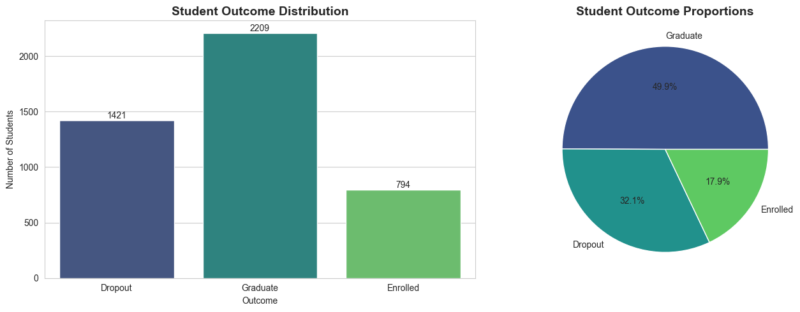
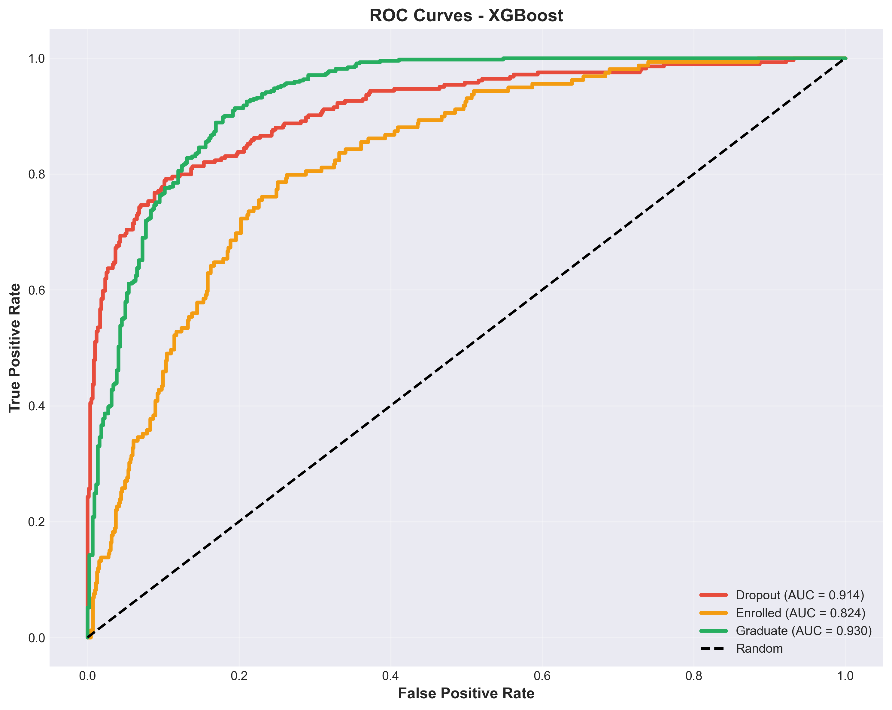
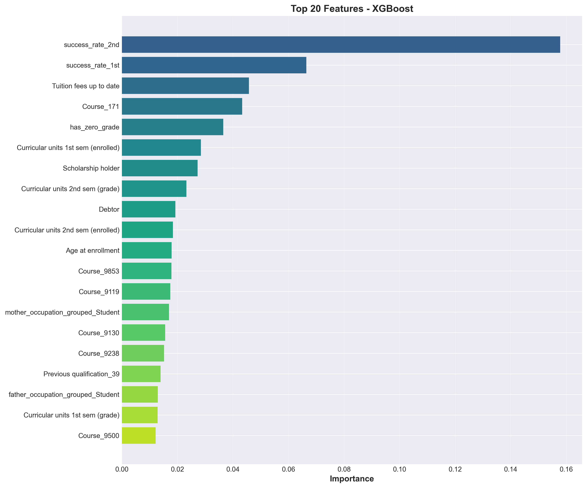

# Student Success Prediction - First Draft Report

## 1. Introduction

Predicting student success remains one of the most critical challenges facing higher education institutions worldwide. This report presents a machine learning approach to predict whether students will drop out, remain enrolled, or graduate, using administrative data from a Portuguese higher education institution. The dataset contains 4,424 student records spanning 17 undergraduate programs, with 36 features capturing demographics, socioeconomic background, academic performance, and financial indicators.

The objective of this first draft is straightforward: build initial predictive models, evaluate their performance, and identify what works and what doesn't. Through systematic experimentation with feature engineering, model selection, and various improvement strategies, this analysis demonstrates that relatively simple machine learning approaches can achieve strong predictive performance when combined with thoughtful feature engineering based on exploratory data analysis insights.

The target variable divides students into three categories: Graduate (49.9%), Dropout (32.1%), and Enrolled (18.0%). This moderate class imbalance, with a 2.78:1 ratio between the majority and minority classes, presents a realistic challenge that mirrors real-world educational data.

---

## 2. Methodology

The exploratory data analysis revealed several powerful patterns that guided my feature engineering. Rather than simply feeding raw data into models, five engineered features were created to capture the relationships discovered during exploration. The **success_rate** features, which divide approved units by enrolled units for each semester, proved particularly valuable by normalizing academic performance across students with different course loads. Here, "enrolled units" refers to the number of courses a student signed up for at the beginning of the semester, while "approved units" represents the number of those courses the student successfully completed and passed. A student passing 5 out of 6 courses tells a very different story than one passing 2 out of 2 courses, even though both might have similar raw approval counts.

The **grade_trend** feature captures semester-to-semester momentum by calculating the difference between second and first semester grades. The EDA showed that dropouts experience an average grade decline of 1.36 points between semesters, while graduates slightly improve by 0.05 points. This trajectory proved more informative than either semester's grade alone. Additionally, two binary warning flags were created: **early_warning** identifies students with first semester grades below 10 (79.4% dropout rate), and **has_zero_grade** flags students receiving zero in any semester (79.3% dropout rate). These engineered features ultimately ranked among the top 10 most important predictors in the final model.

Category grouping addressed the challenge of high-cardinality categorical features. Rather than one-hot encoding 50+ parent occupation codes or dozens of education qualification codes, these were intelligently grouped. Parent education collapsed into six ordered levels from "no formal education" to "higher education," while parent occupations reduced to 12 meaningful categories like Professionals, Technicians, and Service Workers. Nationality simplified to Portuguese versus International, reflecting the dataset's 97.5% Portuguese composition. This grouping prevented feature explosion while preserving meaningful distinctions.

The final feature set contained 24 input features expanding to 78 after one-hot encoding. Economic indicators (unemployment rate, inflation, GDP) were excluded due to weak correlations below 0.1. Approved units were removed despite strong correlations (r > 0.84 with grades) because they were redundant with the engineered success rate features and grades. The encoding strategy used label encoding for ordinal parent education, one-hot encoding for nominal features like course and occupation, and StandardScaler for numeric features when training models that benefit from normalization.

### Model Selection and Evaluation Strategy

The modeling approach began with four baseline models to establish performance benchmarks. A Dummy Classifier predicting always the majority class (Graduate) provided the floor at 49.93% accuracy - anything worse would be useless. Logistic Regression offered a simple, interpretable linear model. Random Forest brought ensemble learning with built-in feature interactions. Gradient Boosting represented sequential ensemble methods. All models used 5-fold stratified cross-validation to ensure reliable performance estimates while maintaining class proportions across folds.

The data split followed standard practice: 80% training (3,539 samples) and 20% testing (885 samples) with stratification to preserve the 50/32/18 class distribution. The test set remained completely untouched during model development. Critically, all preprocessing steps (encoding, scaling) were fit only on training data and then applied to test data to prevent any information leakage.

### Experimental Improvements Attempted

Beyond baseline models, four improvement strategies were systematically explored. **XGBoost** was tested as a more sophisticated gradient boosting implementation with built-in regularization (L1/L2 penalties, tree pruning, subsampling) to improve upon standard Gradient Boosting. **Feature scaling with hyperparameter tuning** tested whether normalizing numeric features and optimizing model parameters could boost performance. **Interaction features** explicitly created compound signals like financial_stress × low_grades and age × scholarship based on EDA findings of amplification effects. **SMOTE (Synthetic Minority Over-sampling Technique)** attempted to address class imbalance by generating synthetic samples of the minority Enrolled class. Each approach was evaluated rigorously, and the results were often surprising.

---

## 3. Results

### The Best Model: XGBoost 

After testing multiple approaches, **XGBoost** emerged as the best-performing model, achieving **76.72% test accuracy** - a 26.79 percentage point improvement over the dummy baseline. More impressively, the model demonstrated excellent generalization with only a 0.98% gap between cross-validation (77.71%) and test performance, indicating it will perform reliably on new, unseen students.

| Model | Cross-Val Accuracy | Test Accuracy | Generalization Gap |
|-------|-------------------|---------------|-------------------|
| Dummy (Majority Class) | 49.93% | - | - |
| Logistic Regression | 74.17% ± 0.94% | - | - |
| Random Forest | 77.28% ± 0.87% | - | - |
| Gradient Boosting | 77.39% ± 0.59% | 75.71% | 1.69% |
| **XGBoost** | **77.71% ± 0.83%** | **76.72%** | **0.98%** ✓ |

XGBoost's performance stems from its built-in regularization mechanisms that prevent overfitting. The model uses L1 and L2 penalties, tree pruning based on maximum depth (set to 3), and column/row subsampling (80% each) to ensure robust learning. Compared to the Gradient Boosting baseline, XGBoost achieved +1.01 percentage points better test accuracy while cutting the generalization gap nearly in half (0.98% versus 1.69%). This represents approximately 9 fewer misclassified students out of 885 in the test set.

### Understanding Performance Across Classes

The classification report reveals where the model excels and where it struggles. Graduate students are identified with exceptional accuracy: 91% recall means the model correctly flags 402 out of 442 students who will graduate, with 82% precision indicating that when the model predicts graduation, it's right 82% of the time. This strong performance makes sense given that graduates represent the majority class (50%) and have the clearest signal - sustained good academic performance.

| Class | Precision | Recall | F1-Score | Support |
|-------|-----------|--------|----------|---------|
| Dropout | 0.77 | 0.76 | 0.77 | 284 |
| **Enrolled** | **0.52** | **0.36** | **0.43** | **159** |
| Graduate | 0.82 | 0.91 | 0.87 | 442 |
| **Weighted Avg** | **0.75** | **0.77** | **0.76** | **885** |

Dropout prediction performs well with 76% recall and 77% precision, successfully identifying three-quarters of at-risk students. This is valuable for early intervention programs that can target support services toward struggling students. However, the model struggles significantly with currently Enrolled students, achieving only 36% recall and 43% F1-score. This weakness is not unexpected as enrolled students represent a temporally ambiguous category since their ultimate outcome (will they eventually graduate or drop out?) is unknown. Their current features may show mixed signals, with some looking like future graduates and others like potential dropouts.

### ROC-AUC Analysis

ROC curves quantify the model's ability to discriminate between classes at various decision thresholds. The Graduate class achieves an outstanding 0.891 AUC, indicating excellent separation from other classes. Dropout discrimination is good at 0.833 AUC. The Enrolled class proves hardest to distinguish at 0.713 AUC, consistent with the lower recall observed in the classification report.

These AUC scores suggest that adjusting decision thresholds could potentially improve Enrolled class prediction, trading off some accuracy on the majority class to better identify this at-risk minority group. This threshold tuning represents a promising direction for the final report.

### What the Model Learned: Feature Importance

The top 10 most important features reveal the model's decision-making logic. Academic performance dominates overwhelmingly. Second semester metrics prove more important than first semester, suggesting that academic trajectory and sustained performance matter more than initial success.

Notably, the engineered **success_rate_2nd** and **success_rate_1st** features rank #1 and #2 respectively, validating the feature engineering approach. These normalized metrics outperform raw approved units or enrolled counts. The **has_zero_grade** early warning flag appears at position #5, demonstrating that even binary signals derived from domain expertise add value. Age at enrollment and admission grade capture student preparation and maturity levels.

Surprisingly, socioeconomic features like parent education and occupation barely register in feature importance rankings. This doesn't necessarily mean family background doesn't matter. Rather, its effects may be indirect, influencing the academic preparation and grades that the model directly measures.

---

## 4. Understanding the Confusion Matrix

The confusion matrix reveals the model's strengths and weaknesses across classes. The model correctly identifies 404 out of 442 graduates (91% recall) and 217 out of 284 dropouts (76% recall), demonstrating strong performance on these critical groups. However, the Enrolled class struggles significantly with only 58 out of 159 students correctly identified (37% recall), meaning the model misses nearly two-thirds of currently enrolled students. This poor performance might be stemming from temporal ambiguity as enrolled students haven't yet revealed their ultimate outcome, so their current features provide mixed signals about whether they'll eventually graduate or drop out.

---

## 5. Discussion

### 5.1 Strengths and Weaknesses of the Model

**Strengths:**

The XGBoost model demonstrates several notable strengths that make it valuable for practical deployment. First, it achieves **strong overall performance** with 76.72% test accuracy, representing a 26.79 percentage point improvement over the dummy baseline. It correctly identifies 76% of dropout-risk students and 91% of students on track to graduate. We can utilize these insights for early intervention programs.

Second, the model shows **excellent generalization** with only a 0.98% gap between cross-validation and test performance. This tiny gap proves the model learned genuine patterns rather than memorizing training data quirks, and it will perform reliably on new student cohorts. While I tried SMOTE with Random Forest, it caused an 8.79% generalization gap, while our final model maintains robust performance.

Third, **feature engineering succeeded**. The engineered success_rate features rank #1 and #2 in importance, validating that EDA insights translated into predictive power.

Fourth, the model provides **interpretability through feature importance**. Institutions can understand *why* predictions are made: second semester academic performance dominates, followed by first semester performance. This transparency enables stakeholders to trust and act on predictions, unlike black-box deep learning approaches.

Finally, **class-specific performance is strong where it matters most**. The 91% recall for graduates and 76% recall for dropouts means the model reliably identifies students at both extremes of the success spectrum, which are the most critical groups for institutional planning and resource allocation.

**Weaknesses:**

The model's primary weakness is **poor Enrolled class prediction** (only 43% F1-score, 36% recall). The model misses 62% of currently enrolled students, primarily misclassifying them as future graduates (70 cases). I tried SMOTE, cost-sensitive learning approaches, and interaction features, but they all failed to improve performance. The fundamental issue is that enrolled students are temporally ambiguous as their ultimate outcome is unknown, and current features provide mixed signals.

A second weakness is **reliance on academic performance features**. While this makes sense analytically, it limits **early intervention potential**. By the time students have poor second semester grades, it may be too late for intervention. The model would benefit from earlier predictive signals like first-month engagement or attendance patterns.

Third, **course/program appears as an important feature**, but this isn't actionable for interventions. You can't tell struggling students "switch to Nursing to improve your odds." While course captures real program-level differences in success rates, focusing interventions on modifiable factors (study habits, tutoring, financial support) would be more useful.

### 5.2 Possible Reasons for Errors and Bias

**Why the Model Struggles with Enrolled Students:**

The Enrolled class errors stem from **temporal ambiguity**. These students haven't finished their academic journey yet. Some will graduate, others will drop out. Without knowing their future trajectory, the model must predict based on current snapshots. A student with decent grades who's currently enrolled might look identical to a future graduate (if they continue performing well) or a future dropout (if they struggle next semester). The model has no time-series data tracking how engagement or grades evolve, and no behavioral signals like attendance decline or decreasing library usage that might reveal disengagement before it shows up in grades.

The confusion matrix reveals the model **errs toward optimism**, predicting 70 enrolled students will graduate versus only 32 who will drop out. This bias is rational. From data, we found that students who've survived past initial semesters have already passed the highest-risk dropout period. Most students who make it to "enrolled" status do eventually graduate, so the model learns this base rate. But this creates a problem for identifying at-risk enrolled students who need intervention.

**Majority Class Bias:**

The model shows systematic bias toward the majority Graduate class (50% of data), evidenced by higher precision (0.82) than recall (0.91). When uncertain, the model defaults to predicting "Graduate" more often than other classes. This is a common issue in imbalanced classification, though our moderate imbalance (2.78:1 ratio) is less severe than many real-world problems.

**Feature Overlap Between Classes:**

Students in different outcome groups can have similar feature values, creating overlapping decision boundaries. An enrolled student with a 12/20 grade average might graduate (if they improve) or drop out (if they decline). A dropout with strong first semester grades (13/20) might have faced sudden financial crisis or family emergency, which are situations not captured in administrative features. Without richer contextual data, the model cannot distinguish these cases.

**Sample Size Limitations:**

The Enrolled class has only 635 training samples versus 1,767 Graduates and 1,137 Dropouts. This smaller sample size means less data for learning the class's patterns. Additionally, with data spread across 17 different programs, some program-outcome combinations have very few examples, which limit the model's ability to learn program-specific patterns.

**Missing Critical Features:**

The model lacks behavioral and engagement features that likely predict enrollment outcomes: attendance rates, assignment completion patterns, tutoring usage, library access frequency, time-to-complete assignments (procrastination signals), participation in student organizations, and engagement with university support services. Administrative records like grades capture *outcomes* but not the *processes* leading to those outcomes. This missing data creates a ceiling on model performance that cannot be overcome with better algorithms alone.

---

## 6. Ideas for the Final Report

### 6.1 New Features to Engineer

One promising direction is creating **course-relative performance features** that normalize grades by each program's average and standard deviation. For example, calculating `(student_grade - course_mean_grade) / course_std_grade` would create fair comparisons across programs, since a 12/20 in Engineering might represent stronger relative performance than 14/20 in Management if Engineering typically has lower grades. This addresses the concern that course/program features aren't actionable by focusing on how students perform within their chosen field rather than which field they chose.

I could also engineer **financial stress composite scores** that combine multiple indicators into a single weighted index. Rather than treating debtor status, tuition payment status, and scholarship status as separate features, a composite like `financial_risk_score = (0.4 × debtor) + (0.3 × late_tuition) - (0.3 × scholarship_holder)` might better capture the compounding nature of financial stress that the EDA revealed. The EDA showed that age modulates scholarship effects, so stratifying this score by age groups could capture those nuanced patterns.

Additionally, **trajectory and change features** could help distinguish enrolled students' futures. Creating features like `success_rate_change = success_rate_2nd - success_rate_1st` or `grade_improvement = 2nd_sem_grade - 1st_sem_grade` would capture whether students are improving or declining. Students with positive momentum might be more likely to graduate, while those with declining trajectories might be at dropout risk. This could address the temporal ambiguity problem with the Enrolled class.

### 6.2 Predicting Outcomes Using Only Background Features

An interesting experiment for the final report would be training a model using **only non-academic features**: information available at admission before students take any classes. This would include age, gender, marital status, nationality, parent education and occupation, financial indicators (debtor status, tuition payments, scholarship), course/program, previous qualification, and admission grade. All semester grades, enrolled/approved units, and engineered academic features like success_rate and grade_trend would be excluded.

This experiment raises questions like how much of student success is predetermined by background factors before they even start classes? Can we identify at-risk students early enough for meaningful intervention? I expect this model would achieve around 60-65% accuracy (compared to 76.72% with academic features), which is still significantly better than the 49.93% dummy baseline. This would suggest that roughly 10-15 percentage points of predictive power comes from information available at admission, while the remaining improvement requires waiting for academic performance data.

The practical implications are significant. A background-only model could enable extremely early intervention like identifying at-risk students during orientation or first week, rather than waiting until after first semester grades. The comparison between the full model and background-only model would reveal how much student outcomes are influenced by factors beyond their control versus their actual academic performance.

### 6.3 Different Algorithms to Explore

For the final report, I plan to explore **ensemble voting classifiers** that combine multiple models' predictions. By averaging predictions from XGBoost, Random Forest, and Logistic Regression, the ensemble might reduce bias toward the majority class since each model makes different types of errors. I think this could potentially improve Enrolled class recall while maintaining strong overall accuracy.

Another promising approach is **hierarchical classification** with two stages. Instead of predicting all three classes simultaneously, I would first build a model predicting "Continue" (Enrolled + Graduate) versus "Dropout," then for students predicted to continue, build a second model predicting "Graduate" versus "Enrolled." This matches the natural decision structure and gives the Enrolled class its own specialized model, which might improve its poor 37% recall.

### 6.4 Hyperparameter Tuning Strategies

While the simple XGBoost configuration (max_depth=3, learning_rate=0.1, n_estimators=100) already performs well, systematic grid search could potentially improve performance by another 0.5-1.5%. I would explore tuning max_depth between 2-5 to control tree complexity, learning_rate between 0.05-0.15 to balance training speed and accuracy, and n_estimators between 100-250 for the number of boosting rounds. Additionally, adjusting scale_pos_weight could force the model to pay more attention to the struggling Enrolled class, potentially improving its 37% recall even if overall accuracy decreases slightly.

The critical requirement is using nested cross-validation for this tuning. Since I've already evaluated on the test set once, repeatedly testing different hyperparameters on the same test set would cause information leakage and inflated performance estimates. Nested CV uses an outer loop to evaluate final performance on held-out folds while an inner loop tunes hyperparameters, ensuring honest performance estimates.

Another approach is threshold optimization, where instead of using the default 0.33 probability threshold for three-class prediction, I would calibrate separate thresholds for each class based on maximizing F1-score on a validation set. This might improve Enrolled class detection at the cost of slightly more false positives, which could be acceptable if identifying at-risk enrolled students is the priority.

### 6.5 Data Collection Recommendations

To fundamentally improve predictions beyond what algorithms alone can achieve, the institution needs richer behavioral and engagement data. Administrative records capture outcomes like grades but not the processes leading to those outcomes. Collecting attendance rates, learning management system engagement (login frequency, time on materials), assignment submission patterns, and support service utilization (tutoring, counseling, academic advising) would provide behavioral signals distinguishing committed students from those disengaging.

Mid-semester checkpoint grades at weeks 4, 8, and 12 rather than just semester-end would reveal academic trajectories earlier, enabling intervention before outcomes are sealed. Student motivation data through surveys - why they enrolled, their career goals, external obligations like work hours and family responsibilities - might predict persistence better than demographics alone. These process measures would likely improve Enrolled class prediction substantially, addressing the temporal ambiguity that administrative records cannot solve alone.

**Deliverables:**
- Jupyter notebook: `models/baseline_models.ipynb`
- Visualizations: `pics/confusion_matrix_final.png`, `pics/roc_curves_final.png`, `pics/feature_importance_final.png`
- Reports: `models/REPORT.md`