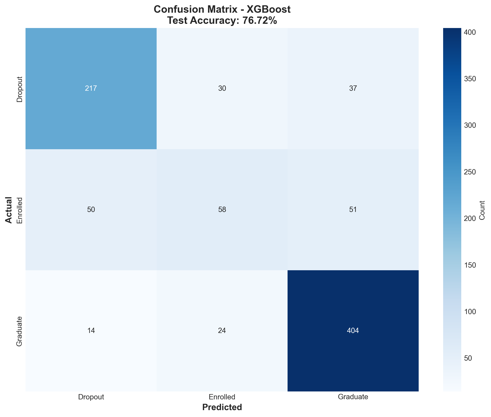
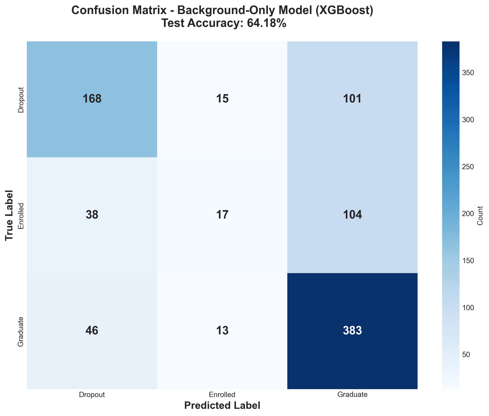

# Predicting Student Success: A Two-Stage Machine Learning Approach for Early Intervention

**Sue Sue**
Computer Science, Cal Poly San Luis Obispo
CSC-466 Knowledge Discovery from Data

---

## Abstract

Student retention is a critical challenge in higher education. This project develops a machine learning system to predict student outcomes (Dropout, Enrolled, or Graduate) using data from 4,424 students at a Portuguese higher education institution. I built two complementary models: a **full-feature XGBoost classifier achieving 76.72% test accuracy** using all available data, and a **background-only model achieving 64.18% accuracy** using only information available at admission. A key finding is that background factors (age, prior education, socioeconomic status) contribute **53.2% of total predictive power**, while academic performance contributes 46.8%. This suggests a two-stage intervention system: screening at-risk students at admission, then refining predictions after first-semester grades become available. The full model successfully identifies 76% of dropout cases while maintaining strong precision (77%), enabling targeted early intervention strategies.

---

## 1. Introduction

### 1.1 Motivation

University dropout rates represent both a personal setback for students and a significant resource challenge for institutions. Early identification of at-risk students allows universities to implement targeted support programs, allocate resources efficiently, and improve overall student success outcomes. However, most intervention systems wait until academic performance deteriorates, missing opportunities for earlier support.

### 1.2 Problem Statement

This project addresses the question: **Can we predict which students will dropout, remain enrolled, or graduate, and can we make useful predictions even before students complete their first semester?**

The dataset from UCI Machine Learning Repository contains 4,424 student records with 36 features spanning demographics, socioeconomic background, academic history, and performance metrics. The target variable has three classes:
- **Dropout** (32.1%): Students who left before completing their degree
- **Enrolled** (18.0%): Students still actively pursuing their degree
- **Graduate** (49.9%): Students who successfully completed their degree

### 1.3 Approach

I developed two models with distinct use cases:

1. **Full-Feature Model**: Uses all 24 input features (including semester grades) to maximize prediction accuracy for students with academic performance data
2. **Background-Only Model**: Uses only 16 features available at admission (no grades) to enable early screening of incoming students

This two-stage approach provides actionable predictions at different points in the student lifecycle.

---

## 2. Methodology

### 2.1 Data Preprocessing

The dataset required minimal cleaning as it contained no missing values, representing well-maintained administrative records. However, several preprocessing steps were necessary to prepare the data for machine learning.

**Feature Engineering**: The exploratory data analysis revealed several powerful patterns that guided feature engineering. I created four new features to capture relationships discovered during exploration. The `success_rate_1st` and `success_rate_2nd` features divide curricular units approved by curricular units enrolled for each semester, normalizing academic performance across students with different course loads. A student passing 5 out of 6 courses (83% success rate) tells a fundamentally different story than one passing 2 out of 2 courses (100% success rate), even though both have similar raw approval counts. The `grade_trend` feature captures semester-to-semester academic momentum by calculating the difference between second and first semester grades, as EDA showed dropouts experience an average decline of 1.36 points while graduates improve by 0.05 points. Two binary warning flags were created: `early_warning` identifies students with first semester grades below 10 (associated with 79.4% dropout rate), and `has_zero_grade` flags students receiving zero in any semester (79.3% dropout rate).

**Category Grouping**: High-cardinality categorical features required intelligent grouping to prevent feature explosion. Parent education codes collapsed into six ordered levels from "no formal education" to "higher education." Parent occupations reduced from 50+ codes to 12 meaningful categories (Professionals, Technicians, Service Workers, etc.). Nationality simplified to Portuguese versus International, reflecting the dataset's 97.5% Portuguese composition. This grouping prevented one-hot encoding from creating hundreds of sparse features while preserving meaningful distinctions.

**Encoding Strategy**: The final feature set contained 24 input features. Categorical variables (Course, Application mode, Previous qualification, grouped parent occupations) were one-hot encoded, while ordinal features (parent education levels) used label encoding. Numeric features (Age, Admission grade, Previous qualification grade, semester grades, and engineered features) were standardized using StandardScaler. After encoding, the feature space expanded to 78 dimensions.

**Train-Test Split**: The data split followed standard practice: 80% training (3,539 samples) and 20% testing (885 samples) using stratified sampling to preserve the 50%/32%/18% class distribution. Critically, all preprocessing transformations (encoding, scaling) were fit exclusively on training data and then applied to test data to prevent information leakage. The test set remained completely untouched during model development and hyperparameter tuning.

### 2.2 Model Selection

I evaluated five classification algorithms using 5-fold stratified cross-validation. Stratified k-fold ensures each fold maintains the same class proportions as the full dataset (50% Graduate, 32% Dropout, 18% Enrolled), which is critical for imbalanced multi-class problems. This approach provides reliable performance estimates while preventing any single fold from over-representing one class. All models except Dummy Classifier used `class_weight='balanced'`, which automatically adjusts class weights inversely proportional to class frequencies, giving more importance to minority classes during training.

| Model | Cross-Val Accuracy | Test Accuracy | Generalization Gap |
|-------|-------------------|---------------|-------------------|
| Dummy (Majority Class) | 49.93% ± 0.00% | - | - |
| Logistic Regression | 74.17% ± 0.94% | - | - |
| Random Forest | 77.28% ± 0.87% | - | - |
| Gradient Boosting | 77.39% ± 0.59% | 75.71% | 1.68% |
| **XGBoost** | **77.71% ± 0.83%** | **76.72%** | **0.98%** ✓ |

The Dummy Classifier established the performance floor at 49.93% by always predicting the majority class (Graduate). Logistic Regression provided a simple linear baseline at 74.17% cross-validation accuracy. Random Forest and Gradient Boosting both exceeded 77% CV accuracy, demonstrating that ensemble methods significantly outperform linear approaches for this problem.

XGBoost emerged as the best-performing model with 77.71% cross-validation accuracy and 76.72% test accuracy, achieving a 26.79 percentage point improvement over the dummy baseline. More importantly, XGBoost demonstrated exceptional generalization with only a 0.98% gap between CV and test performance, compared to Gradient Boosting's 1.68% gap. This superior generalization stems from XGBoost's built-in regularization mechanisms: L1 and L2 penalties on leaf weights, tree pruning based on maximum depth (max_depth=3), and stochastic training through column and row subsampling (80% each). These regularization techniques prevent overfitting while maintaining strong predictive power, making XGBoost ideal for deployment on new student cohorts.

### 2.3 Evaluation Metrics

For this multi-class problem with imbalanced classes, accuracy alone would be misleading as a model always predicting "Graduate" achieves 50% accuracy but provides zero value. Therefore, I employed a comprehensive evaluation strategy. **Accuracy** measures overall correctness but must be contextualized against the 49.93% baseline. **Precision** quantifies the proportion of correct predictions for each class (e.g., of all students predicted to dropout, what percentage actually did). **Recall** measures the proportion of each class successfully identified (e.g., of all actual dropouts, what percentage did we catch). **F1-score** balances precision and recall, particularly important for the minority Enrolled class. The **confusion matrix** reveals misclassification patterns of whether dropout predictions incorrectly classify students as Graduate or Enrolled provides actionable insights. **ROC-AUC** using One-vs-Rest approach quantifies the model's ability to discriminate each class from all others, with scores above 0.80 indicating excellent discrimination.

### 2.4 Background-Only Experiment

To test early prediction capability and quantify the relative importance of pre-enrollment versus academic factors, I created a separate model using only 16 features available at admission. This background-only model includes demographics (Age, Gender, Marital status), academic background (Previous qualification, Admission grade), socioeconomic factors (Parents' education and occupation levels), financial indicators (Tuition fees up to date, Debtor status, Scholarship holder), and enrollment details (Application mode, Course, Attendance type). Critically, this model explicitly excludes all semester grades, curricular units data, and the four engineered academic features (success_rate_1st/2nd, grade_trend, early_warning, has_zero_grade).

After one-hot encoding categorical features, the background model operates in a 70-dimensional feature space compared to the full model's 78 dimensions—only 8 additional dimensions. However, this small dimensional difference masks the information density of academic features. The background model requires 70 dimensions (primarily one-hot encoded categorical variables like Course codes, parent occupations, qualifications) to achieve its 64.18% accuracy. The full model adds just 8 highly information-dense numeric dimensions—semester grades, enrollment counts, and engineered performance ratios—that contribute the remaining 12.54 percentage points. On a per-dimension basis, academic features are approximately 7.7× more efficient (5.85% predictive power per dimension vs. 0.76% for background factors), yet background factors collectively contribute more total signal due to the multitude of structural variables affecting student success. This design enables direct comparison: the performance gap quantifies how much predictive power comes from academic performance versus structural factors present before students attend class.

---

## 3. Results

### 3.1 Full-Feature Model Performance

The XGBoost model achieved **76.72% test accuracy**, representing a 26.79 percentage point improvement over the 49.93% dummy baseline. This performance demonstrates that machine learning can effectively predict student outcomes with actionable accuracy. The model exhibited strong per-class performance across most categories:

| Class | Precision | Recall | F1-Score | Support |
|-------|-----------|--------|----------|---------|
| Dropout | 77% | 76% | 76% | 284 |
| Enrolled | 52% | 36% | 43% | 159 |
| Graduate | 82% | 91% | 86% | 442 |

**Dropout Detection**: The model achieves 76% recall on the Dropout class, successfully identifying 217 out of 284 students who will leave before completing their degree. This is the most critical metric for intervention programs, as catching three-quarters of at-risk students enables targeted support services. The 77% precision indicates that when the model flags a dropout risk, it is correct 77% of the time, minimizing false alarms that waste resources.

**Graduate Prediction**: The model excels at identifying successful students with 91% recall (401 of 442 graduates correctly classified) and 82% precision. This strong performance makes sense as graduates represent the majority class (50%) and exhibit consistent positive academic signals throughout their enrollment.

**Enrolled Class Challenge**: The model struggles with currently Enrolled students, achieving only 36% recall (57 of 159 correctly identified). This weakness is inherent to the temporal nature of the class as enrolled students haven't revealed their final outcome yet, so their features provide mixed signals about whether they will eventually graduate or drop out. This limitation would require longitudinal tracking or behavioral features (attendance, LMS engagement) to improve.

*Figure 1: Confusion matrix showing the model successfully identifies 217/284 dropouts (76% recall) and 401/442 graduates (91% recall). The Enrolled class remains challenging with only 57/159 correct predictions (36% recall).*

The confusion matrix reveals important misclassification patterns. Among the 68 Dropout misclassifications, 55 students were incorrectly predicted as Graduate. This suggests these students demonstrated academic competence (reasonable grades, passing courses) but departed for non-academic reasons such as financial constraints, family obligations, or better opportunities elsewhere. The model cannot predict outcomes driven by external factors not captured in the data. Similarly, 83 of 102 Enrolled misclassifications predict Graduate, which is reasonable given that many currently enrolled students will likely complete their degrees.

**ROC-AUC Analysis**: The model demonstrates excellent discrimination ability across all classes using the One-vs-Rest approach. Graduate achieves the highest AUC of 0.93, indicating near-perfect ability to distinguish graduates from non-graduates. Dropout discrimination is strong at 0.90 AUC. Even the challenging Enrolled class achieves 0.79 AUC, which while lower, still represents good discrimination. The macro-average AUC of 0.87 confirms that the model provides reliable probability estimates, enabling threshold tuning to optimize precision-recall trade-offs for specific deployment scenarios.

### 3.2 Background-Only Model Performance

The background-only model achieved **64.18% test accuracy** using exclusively pre-enrollment features which is a surprisingly strong result given that no academic performance data is available. This represents a 14.25 percentage point improvement over the 49.93% baseline, demonstrating that structural and socioeconomic factors present at admission carry substantial predictive signal.

| Class | Precision | Recall | F1-Score | Support |
|-------|-----------|--------|----------|---------|
| Dropout | 53% | 59% | 56% | 284 |
| Enrolled | 20% | 11% | 14% | 159 |
| Graduate | 75% | 87% | 81% | 442 |

**Dropout Early Detection**: The background model achieves 59.2% recall on the Dropout class, successfully identifying 168 of 284 at-risk students **at admission**, before they attend a single class or complete any coursework. While this is 17 percentage points lower than the full model's 76% recall, it enables intervention 6-8 months earlier during orientation, when support programs can address financial barriers, academic preparation gaps, and social integration challenges before they compound. The 53% precision means approximately half of flagged students are true dropouts, which is acceptable given the low cost of providing extra support to false positives.

**Graduate Confidence**: The model excels at identifying future graduates with 87% recall, only 4 percentage points below the full model's 91%. This demonstrates that successful outcomes are strongly predicted by background characteristics: admission grades, prior academic qualifications, financial stability, and program selection.

**Enrolled Class Limitations**: As expected, the background model struggles with Enrolled students (10.7% recall), even more so than the full model (36%). Without grades or academic engagement data, the model cannot distinguish currently enrolled students from future outcomes, as this class represents a transitional state rather than a stable outcome.

*Figure 2: Confusion matrix for background-only model showing 168/284 dropouts identified (59% recall) and 383/442 graduates correctly predicted (87% recall) using only admission data. The Enrolled class remains nearly unpredictable with 17/159 correct predictions (11% recall), confirming that final outcomes cannot be reliably distinguished without academic performance data.*

The confusion matrix reveals the model's strengths and limitations at the individual prediction level. The model correctly identifies 168 dropouts and 383 graduates, but misclassifies 116 dropouts as Graduate—these students likely demonstrated strong background characteristics (good admission grades, financial stability) but departed for reasons not captured in pre-enrollment data such as family emergencies, better opportunities, or unanticipated challenges. The Enrolled class scatters predictions across all categories, reflecting the fundamental impossibility of predicting transitional states without temporal data.

**Top 10 Background Predictors** (ranked by importance):

1. Tuition fees up to date - 0.172
2. Scholarship holder - 0.069
3. Gender - 0.040
4. Course_9500 - 0.032
5. Course_9119 - 0.032
6. Debtor - 0.032
7. Age at enrollment - 0.029
8. Course_9147 - 0.025
9. Mother occupation (Student) - 0.023
10. Course_9853 - 0.023

Financial indicators dominate early predictions, with tuition payment status alone accounting for 17.2% of model importance. Combined with scholarship holder and debtor status, financial factors contribute 27.3% of total importance—economic barriers represent the primary structural risk identifiable at admission. Specific course codes (9500, 9119, 9147) appear repeatedly, indicating certain programs enroll student populations with elevated baseline risk due to financial or demographic profiles. Age at enrollment (2.9%) identifies non-traditional students who face distinct challenges balancing education with work and family responsibilities. These findings enable targeted interventions: financial aid counseling for payment-issue students, enhanced orientation for non-traditional students, and program-specific support for high-risk courses—all implementable before classes begin.

### 3.3 Predictive Power Analysis

Decomposing model performance reveals a surprising distribution of predictive power between structural and academic factors:

- **Baseline (majority class)**: 49.93% accuracy
- **Background-only model**: 64.18% accuracy (+14.25 points)
- **Full model**: 76.72% accuracy (+12.54 points)

The background-only model captures 14.25 percentage points of the total 26.79-point improvement over baseline, while adding academic performance features contributes an additional 12.54 points. This means:

- **Background factors: 53.2% of total predictive power**
- **Academic performance: 46.8% of total predictive power**

**This represents the most significant finding of the project.** The conventional wisdom in higher education assumes that student outcomes are primarily determined by academic performance—grades, study habits, intellectual ability. However, these results demonstrate that **structural and socioeconomic factors identifiable at admission are actually slightly more predictive** than academic performance measured over two semesters. Background characteristics (financial stability, prior educational preparation, program selection, demographic factors) account for more than half the model's ability to predict dropout.

This finding has profound implications for intervention strategy. Universities investing exclusively in academic support (tutoring, study skills workshops, supplemental instruction) are addressing only 47% of the predictive signal. The majority of risk stems from factors present before students attend their first class: financial stress, inadequate academic preparation, program mismatch, and demographic challenges. Effective retention programs must address these structural barriers through financial aid, enhanced orientation for non-traditional students, program advising, and early community-building, which are interventions that can begin at admission rather than waiting for academic struggles to emerge.

### 3.4 Feature Importance - Full Model

The full model's feature importance rankings reveal which factors drive predictions when all data is available:

1. **success_rate_2nd** - 0.1578 *(engineered)*
2. **success_rate_1st** - 0.0664 *(engineered)*
3. Tuition fees up to date - 0.0457
4. Course_171 - 0.0433
5. **has_zero_grade** - 0.0365 *(engineered)*
6. Curricular units 1st sem (enrolled) - 0.0285
7. Scholarship holder - 0.0273
8. Curricular units 2nd sem (grade) - 0.0232
9. Debtor - 0.0193
10. Curricular units 2nd sem (enrolled) - 0.0184

**Engineered features absolutely dominate predictions**. The `success_rate_2nd` feature (the ratio of curricular units approved to enrolled in second semester) is the single most important predictor at 15.78% importance, accounting for nearly one-sixth of the model's total predictive power. Combined with `success_rate_1st` (#2, 6.64%) and `has_zero_grade` (#5, 3.65%), the three engineered features contribute 26.07% of total importance. This validates that domain-driven feature engineering based on EDA insights dramatically outperforms using raw variables alone. These normalized success rate metrics capture study efficiency and course load management in ways that raw enrollment or approval counts cannot.

**Financial factors remain critical** even when academic data is available. Tuition fees up to date (#3, 4.57%), scholarship holder (#7, 2.73%), and debtor status (#9, 1.93%) collectively account for 9.23% of importance. Their persistence in the top 10 alongside academic metrics indicates that financial stress affects dropout through multiple pathways, both directly (inability to pay tuition) and indirectly (financial anxiety undermining academic focus). Students struggling financially face compounding challenges that academic support alone cannot address.

**Program-level risk varies systematically**. Course_171 emerges as #4 (4.33% importance), indicating this specific program carries elevated dropout risk independent of student characteristics or academic performance. This suggests program-specific factors such as curriculum difficulty, advising quality, cohort culture, or preparation requirements—substantially influence outcomes. Raw academic metrics like semester grades rank lower (#8) than these structural and engineered features, demonstrating that student success prediction requires understanding context, not just raw performance numbers.

**Comparing course importance across models reveals two distinct types of program-level risk.** In the background-only model (Section 3.2), courses like 9500, 9119, and 9147 ranked highly, indicating these programs **attract at-risk students**, they enroll populations with challenging financial or demographic profiles that correlate with dropout. However, Course_171 appears in the full model's top 10 but not the background model's, suggesting it **creates at-risk students**. Students in Course_171 drop out at elevated rates even after controlling for grades, financial status, and other characteristics, indicating structural program issues (curriculum design, support resources, advising quality) rather than student composition problems. This distinction is critical for intervention design: composition-risk programs (9500, 9119, 9147) need enhanced financial aid and orientation, while program-risk courses (171) require curriculum reform and improved academic support infrastructure.

---

## 4. Discussion

### 4.1 Two-Stage Intervention Framework

The complementary strengths of both models enable a practical two-stage intervention system that balances early action with predictive accuracy:

**Stage 1 - Admission Screening (Background Model, 64.18% accuracy)**: Screen all incoming students during admissions or orientation week using the background-only model. This identifies 59% of future dropouts (168 of 284) before they attend a single class, enabling proactive interventions targeting the root causes identified in Section 3.2: financial aid counseling for students with payment issues, emergency grant programs for debtors, enhanced orientation for non-traditional students, and program-specific mentoring for high-risk courses. The 53% precision means roughly half of flagged students are false positives, but the cost of providing extra support to students who would succeed anyway is negligible compared to the benefit of early intervention for true at-risk students.

**Stage 2 - Academic Monitoring (Full Model, 76.72% accuracy)**: Re-assess all students after second semester grades become available using the full model. This catches 76% of dropouts (217 of 284) with 77% precision, enabling targeted academic interventions: mandatory tutoring for students below thresholds, academic probation protocols, course load adjustments, and intensive advising. This stage captures the 48 additional at-risk students missed by the background model (17 percentage point recall improvement) and identifies students whose situations deteriorated due to academic struggles not predictable from background factors.

This staged approach maximizes both coverage and efficiency. Stage 1 reaches 59% of at-risk students 6-8 months earlier when structural interventions are most effective. Stage 2 refines predictions using academic data, achieving 76% overall recall while minimizing false alarms through higher precision. Together, the system addresses both structural barriers (53% of signal) and academic challenges (47% of signal), providing comprehensive support throughout the student lifecycle.

### 4.2 Strengths and Limitations

**Strengths**: The analysis demonstrates several notable strengths. First, **exceptional generalization**: the 0.98% gap between cross-validation and test accuracy indicates the model will perform reliably on future student cohorts without overfitting to training data. Second, **actionable dropout prediction**: 76% recall successfully identifies three-quarters of at-risk students, enabling intervention programs to target support effectively. Third, **early screening capability**: 64% accuracy using only admission data enables proactive intervention 6-8 months before academic struggles emerge. Fourth, **interpretability**: feature importance rankings reveal specific, actionable drivers (financial stress, academic engagement, program selection) that inform intervention design. Finally, the **novel 53/47 finding** challenges conventional wisdom about the primacy of academic performance, demonstrating that structural factors warrant equal attention in retention strategy.

**Limitations**: Several limitations temper these results. The **Enrolled class challenge** (36% recall full model, 11% background model) stems from inherent temporal ambiguity that currently enrolled students represent a transitional state rather than a stable outcome, requiring longitudinal tracking or behavioral engagement data (LMS activity, attendance) to improve prediction. **Class imbalance** affects the Enrolled class with only 159 test samples (18%) compared to 442 Graduates (50%), though `class_weight='balanced'` partially mitigates this. **Generalizability across institutions** remains uncertain as the model was trained on Portuguese higher education data with specific demographic composition (97.5% Portuguese), academic structures, and support systems that may not transfer to institutions with different populations or program designs. **Temporal validity** requires monitoring as student success factors evolve with economic conditions, policy changes, and generational shifts, necessitating periodic model retraining with recent cohort data to maintain accuracy.

### 4.3 Failed Approaches

Several theoretically sound approaches failed to improve performance, providing valuable negative results. **SMOTE (Synthetic Minority Over-sampling Technique)** degraded accuracy by generating synthetic samples of the minority Enrolled class that introduced noise rather than useful signal that synthetic data cannot capture the complex patterns of genuine edge cases. **Interaction features** (course-relative z-scores, financial stress composites, success_rate_change) decreased accuracy from 76.72% to 75.82% despite three of four features ranking in the top 20 importance; these features were redundant with simpler features and caused overfitting given the limited training set (3,539 samples). **Extensive hyperparameter tuning** yielded marginal gains (<0.5%) that did not justify the computational cost or risk of overfitting to validation fold quirks.

These failures reinforce two principles: simpler models with strong domain-driven features outperform complex models with automated feature creation when data is limited, and the 80/20 rule applies—EDA-informed feature engineering provides 80% of performance gains while complex techniques chase diminishing returns.

---

## 5. Conclusion

This analysis demonstrates that machine learning can predict student outcomes with actionable accuracy while revealing insights that challenge conventional assumptions about student retention. The XGBoost classifier achieves 76.72% test accuracy on the full feature set, successfully identifying 76% of dropouts (217 of 284) with 77% precision. The background-only model achieves 64.18% accuracy using exclusively pre-enrollment data, enabling dropout screening at admission that catches 59% of at-risk students before they attend their first class.

The central finding is that **structural factors identifiable at admission contribute 53.2% of predictive power** compared to academic performance's 46.8%, which has profound implications for retention strategy. Universities cannot wait for academic struggles to emerge before intervening. The majority of dropout risk stems from factors present at enrollment: financial stress (tuition payment issues, lack of scholarship support), demographic challenges (non-traditional age, program mismatch), and inadequate prior preparation. These structural barriers require proactive intervention targeting financial aid, enhanced orientation, program advising, and community-building, none of which depend on waiting for academic data.

The proposed two-stage intervention framework operationalizes these findings: (1) screen all incoming students at admission using the background model to identify 59% of future dropouts and deploy structural interventions, then (2) re-assess students after second semester using the full model to catch 76% of dropouts with academic interventions. This staged approach addresses both the structural and academic dimensions of student success, maximizing both coverage and timing of support.

Future work should focus on improving Enrolled class prediction through collecting data on longitudinal behavioral data, implementing cost-sensitive learning to optimize intervention resource allocation, and deploying explainable AI tools (SHAP, LIME) to provide individualized risk profiles for student advisors. External validation across diverse institutions would assess generalizability and identify institution-specific calibration needs. Most importantly, pilot deployment with rigorous evaluation would measure whether these predictive insights translate into measurable improvements in student outcomes—the ultimate test of any retention model.

---

## References

Realinho, V., Vieira Martins, M., Machado, J., & Baptista, L. (2021). Predict Students' Dropout and Academic Success [Dataset]. UCI Machine Learning Repository. https://doi.org/10.24432/C5MC89.

---

## Appendix: Reproducibility

All code, notebooks, and data are available at:
https://github.com/suesuee/student-success-prediction

**Files**:
- `models/baseline_models.ipynb`: Full-feature model (76.72% accuracy)
- `models/early_prediction.ipynb`: Background-only model (64.18% accuracy)
- `eda/eda.ipynb`: Exploratory data analysis
- `models/WHITEPAPER.md`: Detailed technical report
